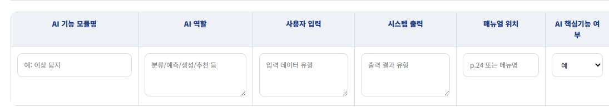
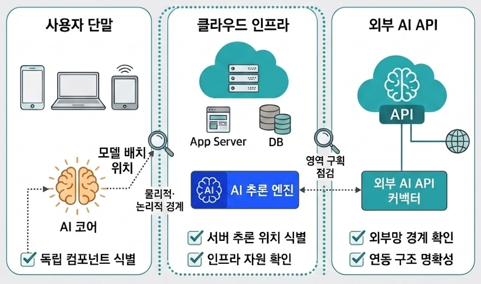
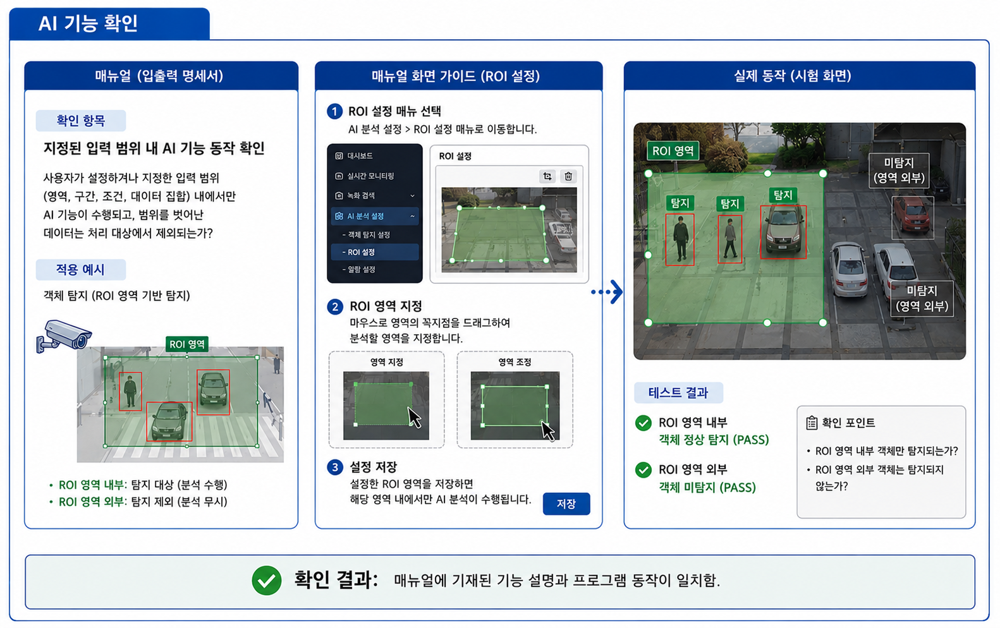
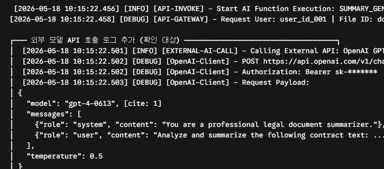

# AI 제품 및 서비스 확인제 기업용 가이드라인 2026. 07. XX

> Source: `AI제품및서비스확인제_가이드라인(기업용)_260626.pptx`

## 목차

*
  2. 목 차
*
  3. 제도 소개
*
  4. 목 적
*
  5. 확인 기준
*
  6. 기술 심사 안내
*
  7. 기술 심사 개요
*
  8. 인공지능 모델 확인
*
  9. 인공지능 모델 확인
*
  10. 인공지능 모델 확인
*
  11. 인공지능 모델 확인
*
  12. 인공지능 모델 확인
*
  13. 인공지능 모델 확인
*
  14. 인공지능 모델 확인
*
  15. 인공지능 기능 확인
*
  16. 인공지능 기능 확인
*
  17. 인공지능 기능 확인
*
  18. 외부모델 연동 확인
*
  19. 주요 AI 제품 및 서비스별 사례
*
  20. AI 적용 확인 가능 사례
*
  21. AI 적용 확인 불가 사례
*
  22. 인정 인공지능 모델
*
  23. 주요 머신러닝 기반 모델
*
  24. 주요 딥러닝 기반 모델
*
  25. 주요 생성형 AI 모델
*
  26. 기타

## 02. 목 차

* 제도 소개 ‧ ‧ ‧ ‧ ‧ ‧ ‧ ‧ ‧ ‧ ‧ ‧ ‧ ‧ ‧ ‧ ‧ ‧ ‧ ‧ ‧ ‧ ‧ ‧ ‧ ‧ ‧ ‧ ‧ ‧ ‧ ‧ ‧ ‧ ‧ ‧ ‧ 3
* 기술 심사 안내 ‧‧ ‧ ‧ ‧ ‧ ‧ ‧ ‧ ‧ ‧ ‧ ‧ ‧ ‧ ‧ ‧ ‧ ‧ ‧ ‧ ‧ ‧ 6
  * 인공지능 모델 확인 ‧ ‧ ‧ ‧ ‧ ‧ ‧ ‧ ‧ ‧ ‧ ‧ ‧ ‧ ‧ ‧ ‧ ‧ ‧ ‧ ‧ ‧ ‧ ‧ 7
  * 인공지능 기능 확인 ‧ ‧ ‧ ‧ ‧ ‧ ‧ ‧ ‧ ‧ ‧ ‧ ‧ ‧ ‧ ‧ ‧ ‧ ‧ ‧ ‧ ‧ ‧ ‧ ‧ ‧ ‧ 14
  * 외부 모델 연동 확인 ‧ ‧ ‧ ‧ ‧ ‧ ‧ ‧ ‧ ‧ ‧ ‧ ‧ ‧ ‧ ‧ ‧ ‧ ‧ ‧ ‧ ‧ ‧ 17
* 주요 AI 제품 및 서비스별 사례 ‧ ‧ ‧ ‧ ‧ ‧ ‧ ‧ ‧ ‧ ‧ ‧ ‧ ‧ ‧ ‧ ‧ ‧ ‧ ‧ 18
  * AI 적용 확인 가능 사례 ‧ ‧ ‧ ‧ ‧ ‧ ‧ ‧ ‧ ‧ ‧ ‧ ‧ ‧ ‧ ‧ ‧ ‧ ‧ ‧ ‧ ‧ ‧ ‧ 19
  * AI 적용 확인 불가 사례 ‧ ‧ ‧ ‧ ‧ ‧ ‧ ‧ ‧ ‧ ‧ ‧ ‧ ‧ ‧ ‧ ‧ ‧ ‧ ‧ ‧ ‧ ‧ ‧ ‧ ‧20
* <별첨>
* 인정 인공지능 모델 ‧ ‧ ‧ ‧ ‧ ‧ ‧ ‧ ‧ ‧ ‧ ‧ ‧ ‧ ‧ ‧ ‧ ‧ ‧ ‧ ‧ ‧ ‧ ‧ 21

## 03. 제도 소개

## 04. 목 적

* 법적근거
* 인공지능 발전과 신뢰 기반 조성 등에 관한 기본법(인공지능기본법) 16조 3항
* 적용 대상
* 인공지능 또는 인공지능기술을 활용한 소프트웨어
* 인공지능 또는 인공지능기술을 활용한 기기(장치)
* 인공지능 또는 인공지능기술을 활용한 클라우드 기반 서비스 (SaaS)
* 인공지능 기술 적용이 확인된 제품 및 서비스가 조달 시우선 고려되도록 하여 인공지능 기술 도입을 촉진하고 활용을 확산하기 위함
* 개 요
* ‘AI 제품 및 서비스 확인제’는 공공조달 시 우선 고려대상이 되는 AI 제품 및 서비스를 확인하기 위한 제도
* 혜택
* 다수공급자계약(MAS) 시 참여 요건 및 절차 완화
* (납품실적)3천만원→폐지,(실적기업)3개사→2개사, (표준규격) 업체 제시 규격 등
* 다수공급자계약(MAS) 2단계 경쟁 대상 금액 상향
* AI 중소기업의 4억원까지 2단계 경쟁 없이 계약 체결 가능(일반중소기업은 1억원까지)
* 일반 입찰 적격 심사 시 신인도 우대를 통한 가점 부여
* SW 단가계약 시 납품실적 요건 면제

## 05. 확인 기준

* 아래 기준을 만족한 경우, AI제품·서비스로 확인

| 구 분      | 번 호 | 확인 내용                                                                                        | 비고              |
| -------- | --- | -------------------------------------------------------------------------------------------- | --------------- |
| 인공지능모델확인 | 1.1 | 제품·서비스에 인공지능처리 연산체계가 적용되어 있는가?                                                               | 서류              |
|          | 1.2 | 
적용된 인공지능처리 연산체계가 학습·추론 등 인공지능으로서 특성을 가지고 있는가?
                                      | 
서류 현장
 |
|          | 1.3 | 제품·서비스에 입력된 데이터가 인공지능처리 연산체계를 거쳐 유의미한 결과(예측, 생성 등)를 출력하는가?                                   | 
서류 현장
 |
| 인공지능기능확인 | 2.1 | 제품·서비스의 구조도상 인공지능 또는 인공지능기술의 위치가 명확하며, 제품·서비스의 구동 체계와 결합되어 동작하는가?                            | 서류              |
|          | 2.2 | 
인공지능처리 연산체계가 제품·서비스의 아래 사항 중 하나 이상에 기여하는가? * 기능 추가, 기능 개선, 사용자 편의성, 접근성 개선, 자원 효율화
 | 
서류 현장
 |
|          | 2.3 | 인공지능처리 연산체계가 적용된 주요 기능이 정상적으로 동작하는가?                                                         | 현장              |
| 외부모델연동확인 | 3.1 | 외부 모델과 연동된 경우 호출 로그나 응용프로그램 프로그래밍 인터페이스 키(API Key)를 확인 가능한가?                                 | 
서류 현장
 |

## 06. 기술 심사 안내

## 07. 기술 심사 개요

* 신청 제품/서비스의 핵심 기능 중 인공지능 기술이 적용된 기능을 선정(1\~3개 권장)하고 아래 정보를 확인합니다.
* < 확인 정보 및 기업 준비 자료 >
* 본 기술 심사는 신청 제품·서비스에 인공지능 기술이 실제로 적용되어 있는지 확인하기 위한 절차
* 심사는 제출된 신청서 및 참고 자료에 대한 서류 확인과,제품 시연 및 운영환경 확인을 통한 현장 확인을 병행하여 진행함
* (서류 확인)AI 모델 또는 외부 AI API의 적용 여부, 입력·출력 데이터 흐름, AI가 수행하는 역할, 제품·서비스 주요 기능과의 결합 관계 등을 확인함
* (현장 확인) 신청서에 제시된 주요 AI 기능이 실제 제품·서비스에서 정상적으로 동작하는지, 입력 데이터가 AI 모델을 거쳐 예측·생성·분류 등 유의미한 결과로 출력되는지 확인함

| 
확인 방법
                | 확인 정보                             | 
기업 준비 자료
             | 
관련 확인 기준 항목
 |
| ------------------------------ | --------------------------------- | ------------------------------ | --------------------- |
| 
서류 확인
                | 회사 및 제품 일반 정보                     | 
- (신청서에 기술)
       |                       |
|                                | AI 적용 목적 및 범위                     |                                | 1.1,2.2               |
|                                | AI 적용 기능 목록                       |                                | 1.1, 2.2              |
|                                | 
AI 적용 기능별 AI 모델 종류, 중요도
 | 모델 파일, 가중치 파일, 로그 등 증빙 자료 (택1) | 1.2, 1.3,2.2          |
|                                | 제품 구조상 AI의 위치                     | 제품 구조도                         | 2.1                   |
| 
현장 확인 (실제품 확인)
 | AI 적용 기능의 중요도(핵심/부가)              | 없음                             | 2.2                   |
|                                | 핵심 AI 기능의 정상 동작 여부                | 없음                             | 2.3                   |
|                                | 외부 인공지능 모델 API 연동 증빙              | 로그                             | 3.1                   |

## 08. 인공지능 모델 확인

* 신청 제품·서비스에 인공지능처리 연산체계(인공지능 모델)가 적용되어 있나요? \[항목 1.1]
* 신청 제품/서비스의 핵심 기능 중 인공지능 기술이 적용된 기능을 선정(1\~3개 권장)하고 아래 정보를 파악합니다.
* 파악한 정보를 아래 신청서 입력 필드에 기재합니다.
* < 핵심 AI 기능 정보 예시 >
* 본 항목은 신청 제품/서비스에 인정되는 인공지능 기술이 적용되었는지 확인하기 위한 단계입니다. 아래 가이드를 참고하여 준비해 주시기 바랍니다.

| 기능명    | AI 역할 | 사용자 입력 유형              | 시스템 출력 유형              | 매뉴얼 참조 위치                |
| ------ | ----- | ---------------------- | ---------------------- | ------------------------ |
| 챗봇     | 응답 생성 | 텍스트                    | 텍스트                    | 
사용자 매뉴얼 30 페이지
 |
| 판매량 예측 | 예측    | 
숫자 (전년도 판매량)
 | 
숫자 (판매량 예측치)
 | 
사용자 매뉴얼 57 페이지
 |

## 09. 인공지능 모델 확인

* 신청 제품·서비스에 인공지능처리 연산체계(인공지능 모델)가 적용되어 있나요? \[항목 1.1]
* 신청서에 기재한 핵심 AI 기능에대한 구체적인 명세를 아래 가이드를 참고하여 입력합니다.
  * Case 1: 자체 학습 모델 사용
* 인정되는 인공지능 모델을 기반으로 학습하였는가?
* ※ 인정되는 인공지능 모델은 별첨된<인정 인공지능 모델> 참조
* 자체 학습 모델이 학습 또는 추론 특성이 있는가?
* ※ 현장 확인을 통해 해당 모델이 학습 및 추론 특성이 있는지 확인함
* 핵심 AI 기능에 대한 기술 명세 시신청 양식을 활용하는 것을 권장하나, 자체 제작 명세서가 있을 경우, 해당 명세서를 제출하셔도 무방합니다. 단, 이 경우 필수 정보는 모두 포함되어 있어야 합니다.
* 유의사항
* 확인 핵심 포인트

| 입력필드명           | 설 명                                                       | 필수여부 |
| --------------- | --------------------------------------------------------- | ---- |
| AI 연산 자원        | GPU,NPU,CPU 등 AI 연산에 활용하는 장치를 기재합니다.                      | O    |
| AI 실행 환경 세부정보   | 운영체제, AI 연산 플랫폼(예: CUDA), 컨테이너 등 AI 모델 실행이 필요한 환경을 기재합니다. | X    |
| 학습 데이터 사양       | 학습 데이터 출처, 유형, 건수 등을 요약하여 기재합니다.                          | O    |
| 개발환경/라이브러리/알고리즘 | 개발환경, 라이브러리, 알고리즘 등에 대한 정보를 요약하여 기재합니다.                   | O    |
| 입력 데이터 설명       | 모델에 입력되는 데이터에 대한 설명을 요약하여 기재합니다.                          | O    |
| 출력 데이터 설명       | 모델에서 출력되는 값에 대한 설명을 요약하여 기재합니다.                           | O    |

## 10. 인공지능 모델 확인

* 신청 제품·서비스에 인공지능처리 연산체계(인공지능 모델)가 적용되어 있나요? \[항목 1.1]
* 신청서에 기재한 핵심 AI 기능에대한 구체적인 명세를 아래 가이드를 참고하여 입력합니다.
  * Case 2: 파인 튜닝 모델
* 인정 가능한 Base Model을 사용했는가?
* ※ 인정되는 인공지능 모델은 별첨된<인정 인공지능 모델> 참조
* 핵심 AI 기능에 대한 기술 명세 시신청 양식을 활용하는 것을 권장하나, 자체 제작 명세서가 있을 경우, 해당 명세서를 제출하셔도 무방합니다. 단, 이 경우 필수 정보는 모두 포함되어 있어야 합니다.
* 유의사항
* 확인 핵심 포인트

| 입력필드명              | 설 명                                                       | 필수여부 |
| ------------------ | --------------------------------------------------------- | ---- |
| AI 연산 자원           | GPU,NPU, CPU 등 AI 연산에 활용하는 장치를 기재합니다.                     | O    |
| AI 실행 환경 세부정보      | 운영체제, AI 연산 플랫폼(예: CUDA), 컨테이너 등 AI 모델 실행이 필요한 환경을 기재합니다. | X    |
| Base Model 명칭 및 버전 | 파인 튜닝에 사용한 기본 모델에 대한 명칭을 정확히 기재합니다.                       | O    |
| 튜닝 방법              | 튜닝에 사용한 방법론을 간략히 기재합니다.                                   | O    |
| 튜닝 데이터셋            | 파인 튜닝 데이터 출처, 유형, 건수 등을 요약하여 기재합니다.                       | O    |
| 입력 데이터 설명          | 모델에 입력되는 데이터에 대한 설명을 요약하여 기재합니다.                          | O    |
| 출력 데이터 설명          | 모델에서 출력되는 값에 대한 설명을 요약하여 기재합니다.                           | O    |

## 11. 인공지능 모델 확인

* 신청 제품·서비스에 인공지능처리 연산체계(인공지능 모델)가 적용되어 있나요? \[항목 1.1]
* 신청서에 기재한 핵심 AI 기능에대한 구체적인 명세를 아래 가이드를 참고하여 입력합니다.
  * Case 3: 외부 AI API 연계
* 인정 가능한 외부 인공지능 서비스를 사용했는가?
* ※ 인정되는 인공지능 모델은 별첨된<인정 인공지능 모델> 참조
* ※ 항목 3.1에 따라 호출로그나 API Key 등이 확인 가능해야함
* 핵심 AI 기능에 대한 기술 명세 시신청 양식을 활용하는 것을 권장하나, 자체 제작 명세서가 있을 경우, 해당 명세서를 제출하셔도 무방합니다. 단, 이 경우 필수 정보는 모두 포함되어 있어야 합니다.
* 유의사항
* 확인 핵심 포인트

| 입력필드명       | 설 명                                                | 필수여부 |
| ----------- | -------------------------------------------------- | ---- |
| 외부 API 및 모델 | AI 기능에 연동하는 AI 서비스 제공자, 외부 API 명칭 및 모델을 정확히 기재합니다. | O    |
| 출력 데이터 설명   | 모델에서 출력되는 값에 대한 설명을 요약하여 기재합니다.                    | O    |

## 12. 인공지능 모델 확인

* 신청 제품·서비스에 인공지능처리 연산체계(인공지능 모델)가 적용되어 있나요? \[항목 1.1]
* 신청서에 기재한 핵심 AI 기능에대한 구체적인 명세를 아래 가이드를 참고하여 입력합니다.
  * Case 4: 온디바이스AI
* 인공지능 모델이 학습 또는 추론 특성이 있는가?
* ※ 현장 확인을 통해 해당 모델이 학습 또는 추론 특성이 있는지 확인할 예정
* 핵심 AI 기능에 대한 기술 명세 시신청 양식을 활용하는 것을 권장하나, 자체 제작 명세서가 있을 경우, 해당 명세서를 제출하셔도 무방합니다. 단, 이경우 필수 정보는 모두 포함되어 있어야 합니다.
* 유의사항
* 확인 핵심 포인트

| 입력필드명         | 설 명                                                       | 필수여부 |
| ------------- | --------------------------------------------------------- | ---- |
| AI 연산 자원      | GPU,NPU, CPU 등 AI 연산에 활용하는 장치를 기재합니다.                     | O    |
| AI 실행 환경 세부정보 | 운영체제, AI 연산 플랫폼(예: CUDA), 컨테이너 등 AI 모델 실행이 필요한 환경을 기재합니다. | X    |
| 타겟 하드웨어·OS    | AI가 실행될 하드웨어 및 OS에 대한 정보를 기재합니다.                          | O    |
| 추론 런타임        | AI 실행 환경을 기재합니다.                                          | O    |
| 입력 데이터 설명     | 모델에 입력되는 데이터에 대한 설명을 요약하여 기재합니다.                          | O    |
| 출력 데이터 설명     | 모델에서 출력되는 값에 대한 설명을 요약하여 기재합니다.                           | O    |

## 13. 인공지능 모델 확인

* 적용된 인공지능처리 연산체계(인공지능 모델)가 학습·추론 등 인공지능으로서 특성을 가지고 있는가? \[항목 1.2]
* (파인 튜닝 모델 및 외부 AI API 연계) ‘인정 인공지능 모델’을 사용한 경우 자동 통과
* (자체 학습 모델 사용및온디바이스AI) 현장 방문 시 시연을 통해 학습 및 추론 특성 확인 필요
  * 예) 학습 데이터 또는 모델 변경 시 출력 값(추론 결과)이 달라질 수 있음을 시연을 통해 증빙
  * 예) 모델 학습, 정확도 검증 등 인공지능 모델 개발 과정 시연을 통해 증빙
  * 예) 학습되지 않은 데이터에 대한 출력 값(추론 결과)이 생성됨을 시연을 통해 증빙
* 학습 또는 추론 특성이 객관적으로 증빙되는가?
* 본 항목은 신청 제품/서비스에 적용한 인공지능 모델이 학습 또는 추론 특성을 가지고 있는지 확인하기 위한 단계입니다. 아래 가이드를 참고하여 준비해주시기 바랍니다.
* 확인 핵심 포인트
* 해당 항목에 대한 증빙이 충분하지 않은 경우, TTA는 보완을 요청할 수 있고 이에 대한 외부 전문가 자문 과정을 거칠 수 있습니다.
* 유의사항

## 14. 인공지능 모델 확인

* 제품·서비스에 입력된 데이터가 인공지능처리 연산체계를 거쳐 유의미한 결과(예측, 생성 등)를 출력하는가? \[항목 1.3]
* 아래 기법을 참고하여 입력값 변경에따라 출력값이 모델의 학습된 패턴에 따라 합리적으로 변화하는지 확인할 수 있도록 시연 준비 필요
* ※ 단순 매핑·하드코딩이 아닌지 검증
* 반복 입력을 통한 일관성 확인: 동일 입력을 수회 반복하여 결정론적 모델은 동일 출력, 확률적 모델(생성형 AI 등)은 합리적 분포 내 출력을 확인
* Out-of-Sample 입력 처리: 학습 데이터에 없는 신규 입력을 투입했을 때 시스템이 적절한 예외 처리(Fallback)를 하거나, 예측 신뢰도(Confidence Score)를 낮게 산출하는지 확인
* 입력 변화에 따른 출력 경향성 검증: 입력값의 수치나 강도가 단계별로 변할 때, 출력값도 모델이 학습한 패턴에 따라 합리적으로 변하는지 검증
* 모델 연산 시, 리소스 사용량 증가 확인
* 연산 자원 사용 패턴 모니터링: 추론 시 GPU 연산 리소스 사용량이 모델 호출시점과 일치하는지 확인
* 출력값 생성에 인공지능 모델이 관여하는가?
* 인공지능 모델을 우회하여 단순 매핑, 하드코딩된 알고리즘으로 출력값을 생성하지 않는가?
* 본 항목은 신청 제품/서비스에 적용한 인공지능 모델이 제품/서비스에 입력된 데이터를 처리하여 그 특성에 맞는 결과를 내는지 확인하기 위한 단계입니다. 아래 가이드를 참고하여 준비해주시기 바랍니다.
* 확인 핵심 포인트
* 인공지능 모델이 아닌 단순 매핑이나 하드코딩된 룰 베이스 알고리즘이 아닌지 검증하기 위해서 적절한 검증 기법을 추가하여 확인할 수 있습니다
* 유의사항

## 15. 인공지능 기능 확인

* 제품·서비스의 구조도상 인공지능 또는 인공지능기술의 위치가 명확하며, 제품·서비스의 구동 체계와 결합되어 동작하는가? \[항목 2.1]
* 본 항목은 신청 제품/서비스에 적용한 인공지능 모델이 핵심 기능 구현을 위해 사용되었는지를 확인하기 위한 단계입니다. 아래 가이드를 참고하여 준비해주시기 바랍니다.
* 인공지능 모델 컴포넌트 위치를명확히 표시하여 아키텍처 설계도를 준비합니다.
* AI 모델이구동되는운영환경(서버, Cloud, 외부 AI API, 사용자단말 등)이아키텍처상에서식별되고, 모델위치가명확히표현되었는지확인
* 식별된 AI 모델을 통해 제품 서비스의 기능이 동작함을 확인합니다.
* AI 모델 컴포넌트를 삭제할 경우, 제품 기능 수행이 불가능하거나 성능이 저하되는지 확인함
* \[제품 아키텍처 설계도 예시]
  * AI 모델 위치가 명확한가?
  * AI 모델 컴포넌트를 삭제할 경우, 기능 수행이 불가능하거나 성능이 저하됨이 확인되었는가?
* 확인 핵심 포인트

## 16. 인공지능 기능 확인

* 인공지능처리 연산체계가 제품·서비스의 아래 사항 중 하나 이상에 기여하는가? \[항목 2.2]
* 제품/서비스에 AI 기술을 적용한 목적을 파악하여 ‘AI 적용 목적’을 작성합니다.
* 기능 추가: AI 적용을 통해 기존 제품에 없던 핵심 기능이 추가된 경우
* 기능 개선: AI 적용을 통해 출력의 정확도 및 품질을 개선시킨 경우
* 사용자 편의성: AI 적용을 통해 핵심 기능에서의 사용자 입력·조작 단계 단축및반복작업 감소시킨 경우
* 접근성 개선:AI 적용을 통해 텍스트, 음성, 이미지 등 다양한 입력방식을 지원하는 경우
* 자원 효율화: AI 적용을 통해 CPU/GPU 사용량, 응답 시간, 처리량 등을 개선한 경우
* 선택한 ‘AI 적용 목적’에 따라 아래 사항을 준비합니다.
* 기능 추가/기능 개선: 확인 사항 없음
* 사용자 편의성/접근성 개선/자원 효율화: 개선 결과에 대한 증빙(예: GPU 사용량 비교표)을 확인
  * AI 적용 목적이 기능 확장, 기능 고도화등 5개 유형에 해당되는가?
  * AI 적용을 통한 기능 구현 및 개선 사항이 정량적으로 확인되는가?
* 유의사항
* 기능 확장, 기능 고도화 등 5개 유형은 필요시, 전문가 자문을 통해 생산성 향상을 검토하고 추가될 수 있습니다.
* 본 항목은 적용된 인공지능 모델을 통해 사용자가 얻을 수 있는 유익이 있는지 평가하기 위한 단계입니다. 아래 가이드를 참고하여 준비해주시기 바랍니다.
* 확인 핵심 포인트

## 17. 인공지능 기능 확인

* 인공지능처리 연산체계가 적용된 주요 기능이 정상적으로 동작하는가? \[항목 2.3]
* (인공지능 적용 기능 확인) 항목 1.1에 기술한 기능에 대해서 정상 동작 여부를 확인할 수 있는 시나리오를 준비합니다.
* (학습 기능이 있을 경우) 학습 데이터 추가 및 업데이트 후 기존 기능 동작 여부 및 신규 데이터가 반영되는지 확인
  * 다양한 입력 값에 대해 AI 적용 기능이 정상적으로 수행되는가?
* 본 항목은 인공지능 모델을 적용한 기능이 정상적으로 동작하는지 확인하기 위한 단계입니다. 아래 가이드를 참고하여 준비해주시기 바랍니다.
* 확인 핵심 포인트
* 유의사항
* 데이터 입력 범위는 사용자 매뉴얼, 제품 설명서, 신청서 등을 통해 확인 가능합니다.
* 기능 확인을 위해서 경계값 분석, 동등 클래스 분할 등 다양한 테스트 기법들을 적용할 수 있습니다.

## 18. 외부모델 연동 확인

* 외부 모델과 연동된 경우 호출 로그나 응용프로그램 프로그래밍 인터페이스 키(API Key)를 확인 가능한가? \[항목 3.1]
* 호출 로그, API Key 설정 정보 등 AI 서비스 연동 여부를 확인할 수 있도록 시연 준비
* 예) AI 기능 실행 시, 호출 로그에 호출 내역이 추가되는지 확인
  * 외부 AI 모델의 호출 로그나 API Key 등이 확인 가능한가?
* 본 항목은 외부 인공지능 모델을 적용한 경우, 실제 적용 여부를 확인하기 위한 단계입니다. 아래 가이드를 참고하여 준비해주시기 바랍니다.
* 확인 핵심 포인트

## 19. 주요 AI 제품 및 서비스별 사례

## 20. AI 적용 확인 가능 사례

*
  1. 자체 개발 AI 솔루션
* 업무 데이터 기반 LLM 질의응답 솔루션
* 기관 내부 규정 연계형 지식 관리 RAG 기반챗봇 솔루션등
*
  2. 외부 AI 모델·엔진·API 연동 기반 AI 핵심기능 솔루션
* LLM 연동 기반 문서 자동 검토 및 요약 시스템
* AI Agent 기반 업무흐름설계 및 자동 실행 도구
* AI 기반 OCR 문서 인식·문서유형 분류·항목 추출 솔루션
* AI 기반 도메인 특화 다국어 번역 솔루션
* AI 기반 개인정보 문맥 탐지, 비식별화, 마스킹프로그램 등
*
  3. 실시간 영상 인식 및 안전 제어 솔루션
* 객체인식 영상 분석 솔루션
* 지능형 CCTV 선별관제 및 화재 탐지 시스템
* AI 기반 도로 환경 분석 솔루션
* AI 기반 보행자 위험 행동 실시간 경고 시스템
* 영상 기반 불량품 자동 검사 시스템 등
*
  4. 기계학습 기반 예측, 탐지, 최적화 시스템
* 행위 기반 악성코드 및 랜섬웨어 탐지 보안 소프트웨어
* 네트워크 트래픽 이상행위 탐지 솔루션
* 시설물 이상징후 탐지 및 고장 예측 시스템
* AI 기반 수요예측·에너지 사용량 예측·운영 최적화 시스템
* AI 기반 장애 예측 및 IT 운영 자동화 시스템 등

## 21. AI 적용 확인 불가 사례

*
  1. 범용 하드웨어 내 외부 AI 앱 단순 설치 제품
* 일반 PC, 키오스크등을 납품하면서 AI 바로가기, 앱을 설치한 경우
* AI 기능이 하드웨어 제어, 핵심 기능과 연결되지 않은 경우
* AI 앱, API를 제거해도 제품 주요기능이 동작하는 경우 등
*
  2. 도움말/FAQ/Q\&A 단순 연동 제품
* 제품 사용법을 알려주는 AI 챗봇 기능제공하는 경우
* 메뉴 위치를 안내하는 AI 기능을 제공하는 경우
* FAQ 검색에만 LLM을 연동한 경우
* 고객 응대용 챗봇을 부가 기능으로 탑재한 ERP·업무 시스템
* AI 기능이 제품의 핵심 기능이 아니라 사용 편의 또는 보조 기능에
* 해당하며, AI를 제거해도 제품 본래 기능 수행에 지장이 없는 경우
*
  3. 외부 AI API 단순 호출 제품
* 외부 LLM의 응답 결과를 화면에 단순 텍스트 출력(중개)만 하는 경우
* (제품의 핵심 기능과 기술적 결합성이 약한 제품)
* 외부 AI 서비스의 화면을 단순 표시하거나, 별도의 데이터 연계·처리·제어 없이 접근 수단만 제공하는 경우
* 확인 대상 제품의 처리 로직 없이 범용 AI 프롬프트 창을 그대로 노출하여 단순 질의응답 기능만 제공하는 경우 등
*
  4. 하드코딩 된 고정형 규칙에 의해서만 동작하는 프로그램
* IF 조건문 기반 추천 기능을 ‘AI 추천’으로 표시한 경우
* 평균, 합계, 비율, 임계치 초과 알림을 ‘AI 분석’으로 표시한 경우
* 사전 정의된 시나리오 챗봇을‘AI 챗봇’으로 표시한 경우
* 데이터 학습, 추론 없이 단순 키워드 매칭(동의어 검색 등)을 'AI 검색'으로 명시한 경우 등

## 22. 인정 인공지능 모델

## 23. 주요 머신러닝 기반 모델

* 유의사항
* 목록에 없는 모델도 ‘항목 1.2＇에 따라 검토 후 인정 가능합니다.

| 유형                     | 라이브러리                  | 공식 모듈명                                                                                                                                                                                                                                                                                                                                                                                                                                                                                                                                                                                                                                                                                                                                                                                                                                         |
| ---------------------- | ---------------------- | ---------------------------------------------------------------------------------------------------------------------------------------------------------------------------------------------------------------------------------------------------------------------------------------------------------------------------------------------------------------------------------------------------------------------------------------------------------------------------------------------------------------------------------------------------------------------------------------------------------------------------------------------------------------------------------------------------------------------------------------------------------------------------------------------------------------------------------------------- |
| 
지도학습 (분류/회귀)
 | scikit-learn (sklearn) | 
sklearn.linear_model.LinearRegression sklearn.linear_model.LogisticRegression sklearn.svm.SVC (Support Vector Classification) sklearn.ensemble.RandomForestClassifier sklearn.linear_model.Ridge sklearn.linear_model.Lasso sklearn.linear_model.ElasticNet sklearn.svm.SVR (Support Vector Regression) sklearn.ensemble.RandomForestRegressor sklearn.ensemble.GradientBoostingClassifier sklearn.ensemble.GradientBoostingRegressor sklearn.ensemble.AdaBoostClassifier sklearn.ensemble.ExtraTreesClassifier sklearn.tree.DecisionTreeClassifier sklearn.tree.DecisionTreeRegressor sklearn.neighbors.KNeighborsClassifier sklearn.neighbors.KNeighborsRegressor sklearn.naive_bayes.GaussianNB sklearn.naive_bayes.MultinomialNB sklearn.cross_decomposition.PLSRegression
 |
| 
부스팅 알고리즘
     | XGBoost / LightGBM     | 
xgboost.XGBClassifier/xgboost.XGBRegressor lightgbm.LGBMClassifier/lightgbm.LGBMRegressor
                                                                                                                                                                                                                                                                                                                                                                                                                                                                                                                                                                                                                                                                                                                                            |
| 
비지도학습 (군집)
   | scikit-learn (sklearn) | 
sklearn.cluster.Kmeans sklearn.decomposition.PCA
                                                                                                                                                                                                                                                                                                                                                                                                                                                                                                                                                                                                                                                                                                                                                                                     |
| 통계식 시계열 분석             | statsmodels            | statsmodels.tsa.arima.model.ARIMA                                                                                                                                                                                                                                                                                                                                                                                                                                                                                                                                                                                                                                                                                                                                                                                                              |

## 24. 주요 딥러닝 기반 모델

* 유의사항
* 이외에도 공개 모델 저장소(Hugging Face 등)에 배포된 모델을 사용하는 경우 모델 설명서(Model Card) 내 기반 모델, 데이터 출처, 성능 지표 등이 확인되는 경우에 한해 인정 가능합니다..

| 유형                              | 라이브러리                                                       | 모듈명                                                                                                                                                                                                                                                                                                                                                                                                                                                                                                                                             |
| ------------------------------- | ----------------------------------------------------------- | ----------------------------------------------------------------------------------------------------------------------------------------------------------------------------------------------------------------------------------------------------------------------------------------------------------------------------------------------------------------------------------------------------------------------------------------------------------------------------------------------------------------------------------------------- |
| 시각 인지 (CNN 계열)                  | PyTorch / TensorFlow Ultralytics                            | 
torchvision.models.resnet50 keras.applications.resnet50.ResNet50 ultralytics.YOLO ultralytics.YOLOv8 ultralytics.YOLOv10 ultralytics.YOLO11 torchvision.models.resnet101 torchvision.models.vgg16 torchvision.models.efficientnet_b0 torchvision.models.efficientnet_v2_s torchvision.models.convnext_tiny torchvision.models.vit_b_16 torchvision.models.swin_tkeras.applications.vgg16.VGG16 keras.applications.efficientnet.EfficientNetB4 keras.applications.mobilenet_v3.MobileNetV3Large
 |
| 
시각 인지 (이미지 확장, 페이스 등)
 | timm / segmentation\_models\_pytorch /Detectron2 (Facebook) | 
timm.models.resnet50 timm.models.efficientnet_b0 segmentation_models_pytorch.Unet detectron2.modeling.build_model
                                                                                                                                                                                                                                                                                                                                                                                                               |
| 
시계열 (RNN 계열)
          | PyTorch / Keras                                             | 
torch.nn.LSTM / torch.nn.GRU keras.layers.LSTM / keras.layers.GRU torch.nn.Transformer
                                                                                                                                                                                                                                                                                                                                                                                                                                             |
| 자연어 이해 (NLU)                    | Hugging Face (Transformers)                                 | 
transformers.BertModel transformers.AutoModelForSequenceClassification transformers.RobertaModel transformers.DistilBertModel transformers.ElectraModel transformers.AlbertModel transformers.T5Model transformers.BartModel
                                                                                                                                                                                                                                                                                        |

## 25. 주요 생성형 AI 모델

* 유의사항
* 이외에도 공개 모델 저장소(Hugging Face 등)에 배포된 모델을 사용하는 경우 모델 설명서(Model Card) 내 기반 모델, 데이터 출처, 성능 지표 등이 확인되는 경우에 한해 인정 가능합니다..

| 유형                 | 라이브러리                       | 모듈명                                           |
| ------------------ | --------------------------- | --------------------------------------------- |
| 프레임워크 연동           | LangChain                   | langchain\_core.language\_models.chat\_models |
| 오픈소스 대형 모델         | Hugging Face (Transformers) | transformers.AutoModelForCausalLM             |
| 텍스트 임베딩            | OpenAI Python SDK           | openai.resources.embeddings                   |
| 상용 독점 모델 API       | Anthropic SDK               | anthropic.resources.messages (Claude)         |
|                    | Google Generative AI        | google.generativeai.GenerativeModel (Gemini)  |
|                    | OpenAI Python SDK           | openai.resources.chat.completions             |
| 오픈소스 LLM 가중치       | Meta AI (Llama)             | Llama-3-8B-Instruct                           |
|                    | Meta AI (Llama)             | Llama-3-70B-Instruct                          |
|                    | Mistral AI                  | Mistral-7B-Instruct                           |
|                    | Mistral AI                  | Mixtral-8x7B-Instruct                         |
|                    | Alibaba Cloud (Qwen)        | Qwen2.5-7B-Instruct                           |
|                    | Alibaba Cloud (Qwen)        | Qwen2.5-Coder                                 |
|                    | DeepSeek                    | DeepSeek-V3                                   |
|                    | DeepSeek                    | DeepSeek-R1                                   |
|                    | Google (Gemma)              | Gemma-2-9b                                    |
|                    | Google (Gemma)              | Gemma-2-27b                                   |
|                    | Microsoft (Phi)             | Phi-3-mini-instruct                           |
| 국내 도메인 모델 API      | Naver Cloud (HyperCLOVA-X)  | HyperCLOVA-X CLOVA Studio API                 |
|                    | Upstage (Solar)             | Solar-10.7B-Instruct API                      |
| 이미지 생성 (Diffusion) | Hugging Face (Diffusers)    | diffusers.StableDiffusionPipeline             |
|                    | Hugging Face (Diffusers)    | diffusers.StableDiffusionXLPipeline           |
|                    | Hugging Face (Diffusers)    | diffusers.FluxPipeline                        |
| 이미지 생성 고속화         | Hugging Face (Diffusers)    | diffusers.LatentConsistencyModelPipeline      |
| 이미지 조건 제어          | Hugging Face (Diffusers)    | diffusers.ControlNetModel                     |
| 오디오/음성 생성 (TTS)    | Hugging Face (Transformers) | transformers.SpeechT5ForTextToSpeech          |
| 음성 인식 (STT)        | Hugging Face (Transformers) | transformers.WhisperForConditionalGeneration  |
| 오디오 오케스트레이션        | Hugging Face (Transformers) | transformers.BarkModel                        |
| 이미지 생성 최신화         | Hugging Face (Diffusers)    | diffusers.SanaPipeline                        |
| 클라우드 상용 서비스 연동     | Midjourney API              | midjourney.api                                |
|                    | Suno AI API                 | suno.api                                      |
|                    | ElevenLabs API              | elevenlabs.api                                |

## 26. 기타

| 유형                       | 라이브러리                                     | 모듈명                                                       |
| ------------------------ | ----------------------------------------- | --------------------------------------------------------- |
| 강화학습 (RL)                | Stable-Baselines3                         | stable\_baselines3.PPO                                    |
|                          | Stable-Baselines3                         | stable\_baselines3.DQN                                    |
|                          | Stable-Baselines3                         | stable\_baselines3.A2C                                    |
|                          | Stable-Baselines3                         | stable\_baselines3.SAC                                    |
|                          | Stable-Baselines3                         | stable\_baselines3.TD3                                    |
|                          | Ray (RLlib)                               | ray.rllib.algorithms.ppo.PPO                              |
|                          | Ray (RLlib)                               | ray.rllib.algorithms.dqn.DQN                              |
|                          | Ray (RLlib)                               | ray.rllib.algorithms.sac.SAC                              |
| 이상 징후 탐지 (Anomaly)       | 
scikit-learn (sklearn)
          | sklearn.ensemble.IsolationForest                          |
|                          | scikit-learn (sklearn)                    | sklearn.svm.OneClassSVM                                   |
|                          | scikit-learn (sklearn)                    | sklearn.neighbors.LocalOutlierFactor                      |
|                          | scikit-learn (sklearn)                    | sklearn.covariance.EllipticEnvelope                       |
| 
이상 탐지 패키지 전문화
  | 
PyOD (Python Outlier Detection)
 | pyod.models.knn.KNN                                       |
|                          | PyOD (Python Outlier Detection)           | pyod.models.iforest.IForest                               |
|                          | PyOD (Python Outlier Detection)           | pyod.models.copod.COPOD                                   |
|                          | PyOD (Python Outlier Detection)           | pyod.models.auto\_encoder.AutoEncoder                     |
| 
기계학습 기반 시계열 예측
 | Prophet (Meta)                            | prophet.Prophet                                           |
| 기계학습 기반 시계열 예측           | sktime                                    | sktime.forecasting.arima.ARIMA                            |
| 
딥러닝 기반 시계열 예측
  | 
GluonTS (Amazon)
                | gluonts.mx.model.deepar.DeepAREstimator                   |
|                          | Darts                                     | darts.models.forecasting.tft\_model.TFTModel              |
|                          | Darts                                     | darts.models.forecasting.nhits.NBEATSModel                |
| 그래프 뉴럴 네트워크 (GNN)        | 
PyTorch Geometric (PyG)
      | torch\_geometric.nn.GCNConv                               |
|                          | PyTorch Geometric (PyG)                   | torch\_geometric.nn.GATConv                               |
| 추천 시스템                   | 
Microsoft Recommenders
          | recommenders.models.deeprec.models.xdeepfm.XDeepFMModel   |
|                          | LightFM                                   | lightfm.LightFM                                           |
|                          | Surprise                                  | surprise.prediction\_algorithms.matrix\_factorization.SVD |
